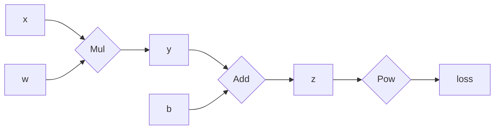
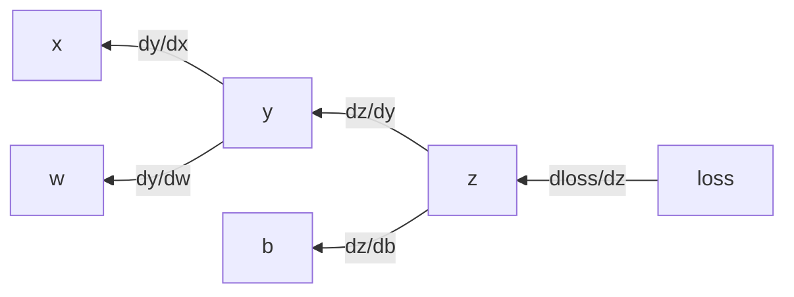

## PyTorch的自动微分机制
`torch.autograd`是`PyTorch`的自动微分引擎，为神经网络训练提供支持。它通过构建一个计算图来跟踪操作。<br>
这个图是一个有向无环图`DAG`，它记录了创建最终输出`Tensor`所涉及的所有操作。<br>
当一个`Tensor`被操作并生成新的`Tensor`时，`PyTorch`会自动构建一个表示这个操作的计算图节点。<br>

`PyTorch`的自动微分系统`Autograd`是其核心功能，使神经网络的训练变得高效简洁。下面从原理到实践全面解释这一机制：<br>

1. 张量与梯度传播

每个张量(tensor)包含：
​data​：原始数值
​grad​：梯度值
​grad_fn​：创建此张量的函数引用
​is_leaf​：是否是叶子节点（用户创建而非操作结果）
​requires_grad​：是否需要计算梯度

'''代码示例'''
```py
# 创建需要跟踪梯度的张量
x = torch.tensor([1.0], requires_grad=False)
w = torch.tensor([2.0], requires_grad=True)
b = torch.tensor([0.5], requires_grad=True)

print(f"x: 值={x.data}, 梯度={x.grad}, 是叶节点={x.is_leaf}")
# 输出: x: 值=tensor([1.]), 梯度=None, 是叶节点=True
```

2. 前向传播构建计算图
当执行运算时，PyTorch自动构建计算图：
```py
# 前向传播
y = w * x       # 乘法运算
z = y + b       # 加法运算
loss = (z - 3)**2  # 损失函数

print(f"y: grad_fn={y.grad_fn}")  # 输出: <MulBackward0 at 0x...>
print(f"z: grad_fn={z.grad_fn}")  # 输出: <AddBackward0 at 0x...>
print(f"loss: grad_fn={loss.grad_fn}")  # 输出: <PowBackward0 at 0x...>
```
下图是上面代码的流程图：<br>

autograd构建一个反向传播的计算图：<br>


y是由w和x相乘所得，那么autograd会自动构建一个反向计算图，节点是乘法的导数，输入为关于y的梯度，输出为x和w的梯度：<br>
根据乘法求导公式: `dy/dx = w, dy/dw = x` <br>
```
y.grad = delta_y 
x.grad = delta_y * dy/dx = delta_y * w
w.grad = delta_y * dy/dw = delta_y * x
```
注：delta_y是y后续操作节点及输出对y的梯度

3. 反向传播自动求导
调用.backward()触发反向传播：
```py
# 反向传播
loss.backward()

# 查看梯度
print(f"∂loss/∂x = {x.grad}")  # tensor([-2])
print(f"∂loss/∂w = {w.grad}")  # tensor([-1])
print(f"∂loss/∂b = {b.grad}")  # tensor([-1])
```

梯度计算过程详解<br>
以上述计算为例：<br>

计算loss对自身的导数：`d(loss)/d(loss) = 1`<br>
根据链式法则逐层回传：<br>

```
d(loss)/d(z) = d(loss)/d(loss) * d(loss)/d(z) 
             = 1 * 2*(z-3) = 2*(2.5-3) = 2*(-0.5) = -1

d(loss)/d(y) = d(loss)/d(z) * d(z)/d(y) = -1 * 1 = -1

d(loss)/d(b) = d(loss)/d(z) * d(z)/d(b) = -1 * 1 = -1

d(loss)/d(x) = d(loss)/d(y) * d(y)/d(x) = -1 * w = -1 * 2 = -2
d(loss)/d(w) = d(loss)/d(y) * d(y)/d(w) = -1 * x = -1 * 1 = -1
```
